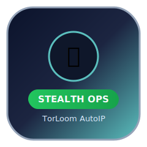
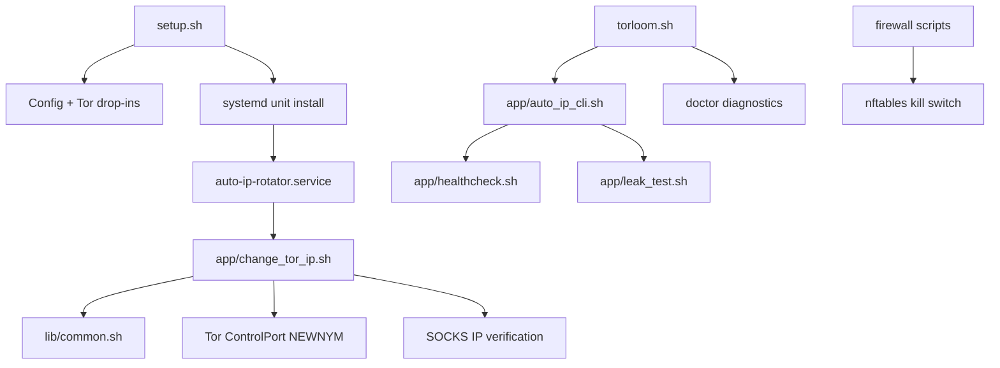

<p align="center">
  
</p>

<p align="center">
  
</p>

<p align="center">
  
</p>

<p align="center">
  <a href="https://github.com/vivekmarathe2004/torloom-autoip/actions/workflows/ci.yml"></a>
  
  
  
  
  
</p>

<p align="center">
  <b>TorLoom AutoIP</b> is a practical privacy automation project for Kali: rotate Tor identities safely, detect failures early, and keep operational controls simple.
</p>

## Why This Project

Most Tor IP changers stop at `NEWNYM` and `sleep`.  
TorLoom AutoIP adds operational safety layers:

- Config validation before runtime
- Single-instance lock protection
- NEWNYM cooldown awareness
- Service hardening with systemd
- Built-in doctor diagnostics
- DNS/IPv6 leak guard and kill-switch integration

## Feature Matrix

| Capability | Included | Notes |
|---|---|---|
| Randomized rotation interval | Yes | Default 30-90s |
| Config preflight (`--validate-config`) | Yes | Fails fast with clear error |
| Single-instance lock | Yes | `flock` + PID fallback |
| NEWNYM cooldown control | Yes | Minimum 10s enforced |
| Tor health monitoring | Yes | Auto-restart + checks |
| Leak tests | Yes | DNS + IPv6 + Tor connectivity |
| Kill switch | Yes | nftables policy |
| Doctor diagnostics | Yes | `auto-ip doctor` |
| Legacy compatibility | Yes | `ip-changer` + `change-tor-ip` alias |
| CI checks | Yes | ShellCheck + syntax + config sanity |

## Quick Start

```bash
git clone https://github.com/vivekmarathe2004/torloom-autoip.git
cd torloom-autoip
sudo chmod +x *.sh firewall/*.sh
sudo ./setup.sh
```

## Command Deck

```bash
# Interactive console
torloom

# Compatibility entries
auto-ip
ip-changer

# One-shot rotation
torloom rotate --once

# Validate config only
torloom rotate --validate-config

# Full diagnostics
torloom doctor

# Leak test
torloom leaktest
```

## Service Control

```bash
sudo systemctl start auto-ip-rotator
sudo systemctl stop auto-ip-rotator
sudo systemctl status auto-ip-rotator

# Legacy alias
sudo systemctl status change-tor-ip
```

## Architecture



## Project Layout

```text
torloom-autoip/
├── torloom.sh
├── setup.sh
├── uninstall.sh
├── app/
├── configs/
├── firewall/
├── lib/
├── docs/
├── scripts/ci/
└── systemd/
```

## Configuration

System config:

```text
/etc/auto-ip/auto-ip.conf
```

User fallback config:

```text
~/.config/auto-ip/auto-ip.conf
```

Key options:

- `INTERVAL_MIN`
- `INTERVAL_MAX`
- `MAX_CHANGE_RETRIES`
- `NEWNYM_MIN_COOLDOWN`
- `ENABLE_FIREWALL`

## Logs

System logs:

```text
/var/log/auto-ip/errors.log
/var/log/auto-ip/rotations.log
/var/log/auto-ip/tor-status.log
```

User fallback logs:

```text
~/.local/state/auto-ip/logs/
```

## Troubleshooting

<details>
<summary>Tor service inactive</summary>

```bash
sudo systemctl restart tor
sudo systemctl restart tor@default
```

</details>

<details>
<summary>Control cookie permission error</summary>

- Ensure `CookieAuthFileGroupReadable 1` is set in Tor config.
- Ensure user is in Tor group (`debian-tor` or `tor`).
- Re-login after group update.

</details>

<details>
<summary>No internet after kill switch</summary>

```bash
sudo /opt/auto-ip/firewall/remove_killswitch.sh
sudo systemctl restart nftables
```

</details>

## Docs

- Full operator manual: [`docs/MANUAL.md`](docs/MANUAL.md)

## Legal and Safety

Use only in legal and authorized environments.  
Tor rotation does not eliminate browser fingerprinting or account-linkage risk.
